# Manual Técnico
## Sistema de Base de Datos IMDB con Alta Disponibilidad

**Proyecto:** Fase 2 - Bases de Datos 2  
**Universidad:** San Carlos de Guatemala  
**Fecha:** Octubre 2025

---

## Tabla de Contenidos

1. [Arquitectura del Sistema](#arquitectura-del-sistema)
2. [Componentes Técnicos](#componentes-técnicos)
3. [Configuración de Replicación Maestro-Maestro](#configuración-de-replicación-maestro-maestro)
4. [Sistema de Backups Automáticos](#sistema-de-backups-automáticos)
5. [Integración con Redis](#integración-con-redis)
6. [API y Lógica de Failover](#api-y-lógica-de-failover)
7. [Estructura del Proyecto](#estructura-del-proyecto)
8. [Archivos de Configuración](#archivos-de-configuración)
9. [Scripts de Automatización](#scripts-de-automatización)
10. [Requisitos del Sistema](#requisitos-del-sistema)

---

## 1. Arquitectura del Sistema

### 1.1 Diagrama de Arquitectura


### 1.2 Flujo de Datos

1. **Cliente** → API REST (puerto 5000)
2. **API** → PostgreSQL Master activo
3. **Master activo** → Replica datos al otro Master (replicación bidireccional)
4. **pgBackRest** → Ejecuta backups automáticos cada 24 horas
5. **API** → Registra metadata de backups en Redis
6. **Failover:** Si Master 1 falla → API cambia automáticamente a Master 2
7. **Failback:** Cuando Master 1 se recupera → Puede regresar tráfico manualmente

---

## 2. Componentes Técnicos

### 2.1 Base de Datos PostgreSQL

**Versión:** PostgreSQL 16

**Configuración Master 1:**
- **Host:** imdb-master1
- **Puerto:** 5432
- **Usuario:** root
- **Password:** root
- **Base de datos:** bases2-db

**Configuración Master 2:**
- **Host:** imdb-master2
- **Puerto:** 5433
- **Usuario:** root
- **Password:** root
- **Base de datos:** bases2-db

### 2.2 Redis

**Versión:** Redis 7

**Configuración:**
- **Host:** imdb-redis
- **Puerto:** 6379
- **Persistencia:** RDB + AOF
- **Uso:** Almacenamiento de metadata de backups

### 2.3 API REST

**Tecnología:** Node.js + Express

**Puerto:** 5000

**Funcionalidades:**
- Inserción de géneros
- Detección automática de fallos
- Failover automático
- Failback manual
- Health checks

### 2.4 pgBackRest

**Versión:** 2.48

**Funcionalidad:**
- Backups completos
- Backups diferenciales
- Backups incrementales 
- Compresión y encriptación
- Retención automática

---

## 3. Configuración de Replicación Maestro-Maestro

### 3.1 Arquitectura de Replicación

La replicación maestro-maestro utiliza la replicación lógica nativa de PostgreSQL 16:
- Ambos servidores publican todos sus cambios mediante **publications**
- Cada servidor se suscribe a las publicaciones del otro mediante **subscriptions**
- Los cambios se replican bidireccionalmente en tiempo real
- El parámetro `origin = 'none'` previene bucles infinitos de replicación

**Ventajas de este enfoque:**
- No requiere extensiones adicionales (pglogical)
- Replicación a nivel de tabla
- Menor latencia
- Más estable y soportado nativamente

### 3.2 Configuración de Master 1

**Archivo:** `mm-config/config/master1/master1.conf`

```conf
listen_addresses = '*'
max_connections = 200

# Logical replication
wal_level = logical
max_wal_senders = 20
max_replication_slots = 20
wal_keep_size = 512MB
archive_mode = on
archive_command = 'pgbackrest --stanza=imdb-master1 archive-push %p'

# Performance
shared_buffers = 4GB  
effective_cache_size = 12GB 
maintenance_work_mem = 1GB 
work_mem = 128MB 

checkpoint_timeout = 5min 
checkpoint_completion_target = 0.9
max_wal_size = 2GB
min_wal_size = 1GB

effective_io_concurrency = 200 
random_page_cost = 1.1

password_encryption = scram-sha-256
```

### 3.3 Configuración de Master 2

**Archivo:** `mm-config/config/master2/master2.conf`

```conf
listen_addresses = '*'
max_connections = 200

# Logical replication
wal_level = logical
max_wal_senders = 20
max_replication_slots = 20
wal_keep_size = 512MB
archive_mode = on
archive_command = 'pgbackrest --stanza=imdb-master2 archive-push %p'

# Performance
shared_buffers = 4GB  
effective_cache_size = 12GB 
maintenance_work_mem = 1GB 
work_mem = 128MB 

checkpoint_timeout = 5min 
checkpoint_completion_target = 0.9
max_wal_size = 2GB
min_wal_size = 1GB

effective_io_concurrency = 200 
random_page_cost = 1.1

password_encryption = scram-sha-256
```

### 3.4 Inicialización de Replicación

La replicación se configura automáticamente mediante el servicio `replication-setup` en Docker Compose. Este servicio:

1. Espera a que ambos masters estén saludables
2. Crea el rol `replicator` con permisos de replicación
3. Configura permisos de lectura en el schema `public`
4. Limpia slots y suscripciones anteriores
5. Crea publicaciones en ambos masters
6. Crea suscripciones bidireccionales

**Comandos ejecutados automáticamente:**

```sql
-- Crear rol replicator
CREATE ROLE replicator WITH LOGIN REPLICATION PASSWORD 'repl_pass';

-- Configurar permisos
GRANT USAGE ON SCHEMA public TO replicator;
GRANT SELECT ON ALL TABLES IN SCHEMA public TO replicator;
ALTER DEFAULT PRIVILEGES IN SCHEMA public GRANT SELECT ON TABLES TO replicator;

-- Crear publicación en Master 1
CREATE PUBLICATION pub_imdb FOR ALL TABLES;

-- Crear suscripción en Master 1 (desde Master 2)
CREATE SUBSCRIPTION sub_from_master2
CONNECTION 'host=imdb-master2 port=5432 user=replicator password=repl_pass dbname=bases2-db'
PUBLICATION pub_imdb
WITH (create_slot = true, slot_name = 'slot_2_to_1', copy_data = false, origin = 'none');

-- Crear suscripción en Master 2 (desde Master 1)
CREATE SUBSCRIPTION sub_from_master1
CONNECTION 'host=imdb-master1 port=5432 user=replicator password=repl_pass dbname=bases2-db'
PUBLICATION pub_imdb
WITH (create_slot = true, slot_name = 'slot_1_to_2', copy_data = false, origin = 'none');

```

**Parámetros importantes:**
- `copy_data = false`: No copia datos iniciales (asume que ya están sincronizados)
- `origin = 'none'`: Previene bucles de replicación infinitos
- `create_slot = true`: Crea slot de replicación automáticamente
- `slot_name`: Nombre específico para el slot de replicación

### 3.6 Verificación de Replicación

```sql
-- Ver estado de suscripciones
SELECT subname, subenabled, subslotname 
FROM pg_subscription;

-- Ver estado de publicaciones
SELECT pubname 
FROM pg_publication;

-- Ver slots de replicación activos
SELECT slot_name, slot_type, active, restart_lsn 
FROM pg_replication_slots;

-- Ver estadísticas de replicación
SELECT * FROM pg_stat_subscription;
```

**Salida esperada en Master 1:**
```
 subname         | subenabled | subslotname 
-----------------+------------+-------------
 sub_from_master2| t          | slot_2_to_1
```

**Salida esperada en Master 2:**
```
 subname         | subenabled | subslotname 
-----------------+------------+-------------
 sub_from_master1| t          | slot_1_to_2
```

---

## 4. Sistema de Backups Automáticos

### 4.1 Configuración de pgBackRest

**Master 1 - Archivo:** `pgbackrest/master1/pgbackrest.conf`

```ini
[global]
repo1-path=/var/lib/pgbackrest
spool-path=/var/lib/pgbackrest/spool
log-level-console=info

compress-type=none

process-max=6
delta=y
repo1-bundle=y
repo1-block=y

[imdb-master1]
pg1-path=/var/lib/postgresql/data
pg1-port=5432
pg1-user=root

[GLOBAL:retention]
repo1-retention-full=2
repo1-retention-diff=3
repo1-retention-incr=3
```

**Master 2 - Archivo:** `pgbackrest/master2/pgbackrest.conf`

```ini
[global]
repo1-path=/var/lib/pgbackrest
spool-path=/var/lib/pgbackrest/spool
log-level-console=info

compress-type=none

process-max=6
delta=y
repo1-bundle=y
repo1-block=y

[imdb-master2]
pg1-path=/var/lib/postgresql/data
pg1-port=5432
pg1-user=root

[GLOBAL:retention]
repo1-retention-full=2
repo1-retention-diff=3
repo1-retention-incr=3
```

### 4.2 Tipos de Backup

#### Backup Completo (Full)
```bash
pgbackrest --stanza=imdb --type=full backup
```
- Copia todos los datos
- Tamaño: ~500MB - 2GB
- Duración: 5-15 minutos
- Frecuencia: Semanal

#### Backup Diferencial (Diff)
```bash
pgbackrest --stanza=imdb --type=diff backup
```
- Copia cambios desde último backup full
- Tamaño: ~50-200MB
- Duración: 1-5 minutos
- Frecuencia: Después del full

#### Backup Incremental (Incr)
```bash
pgbackrest --stanza=imdb --type=incr backup
```
- Copia cambios desde último backup (cualquier tipo)
- Tamaño: ~10-50MB
- Duración: 30 segundos - 2 minutos
- Frecuencia: Diaria

### 4.3 Restauración de Backups

#### Restaurar último backup
```bash
pgbackrest --stanza=imdb --delta restore
```

#### Restaurar backup específico
```bash
pgbackrest --stanza=imdb --set=20251007-120000F --delta restore
```

#### Restaurar a punto en el tiempo (PITR)
```bash
pgbackrest --stanza=imdb --type=time --target="2025-10-07 14:30:00" --delta restore
```

---

## 5. Integración con Redis

### 5.1 Estructura de Datos en Redis

**Patrón de llaves:**
```
pgbackrest:backup:{timestamp}
pgbackrest:latest:full
pgbackrest:latest:diff
pgbackrest:latest:incr
```

**Ejemplo de datos almacenados:**
```json
{
  "timestamp": "2025-10-07T12:00:00Z",
  "type": "full",
  "stanza": "imdb",
  "location": "/backups/master1/20251007-120000F",
  "size_bytes": 536870912,
  "size_human": "512MB",
  "duration_seconds": 420,
  "status": "completed",
  "master": "master1"
}
```
---

## 6. API y Lógica de Failover

### 6.1 Arquitectura de la API

**Archivo principal:** `API/server.js`

```javascript
import express from "express";
import dotenv from "dotenv";
import { queryWithFailover, getTxClient, shouldUseSequence, getActiveNode, forcePrimary, forceSecondary } from "./db.js";

dotenv.config();
const app = express();
app.use(express.json());

let useSequenceFlag = false;
(async () => {
  try {
    useSequenceFlag = await shouldUseSequence();
    if ((process.env.USE_SEQUENCE || "").toLowerCase() === "true") useSequenceFlag = true;
    console.log(`[init] USE_SEQUENCE = ${useSequenceFlag}`);
  } catch (e) {
    console.error("[init] Detección de secuencia falló:", e.message);
  }
})();

```

### 6.2 Endpoints de la API

#### POST /generos
```javascript
app.post("/generos", async (req, res) => {
  const { id_genero, genero } = req.body || {};
  if (!genero || typeof genero !== "string" || genero.trim() === "") {
    return res.status(400).json({ ok: false, error: "Campo 'genero' es requerido (string no vacío)." });
  }

  const { client, node } = await getTxClient();
  try {
    await client.query("BEGIN");

    let sql, params;
    if (Number.isInteger(id_genero)) {
      sql = `INSERT INTO public.generos (id_genero, genero) VALUES ($1, $2) RETURNING id_genero, genero;`;
      params = [id_genero, genero.trim()];
    } else if (useSequenceFlag) {
      sql = `INSERT INTO public.generos (genero) VALUES ($1) RETURNING id_genero, genero;`;
      params = [genero.trim()];
    } else {
      await client.query("LOCK TABLE public.generos IN SHARE ROW EXCLUSIVE MODE;");
      const r = await client.query("SELECT COALESCE(MAX(id_genero), 0) + 1 AS next_id FROM public.generos;");
      const nextId = r.rows[0].next_id;
      sql = `INSERT INTO public.generos (id_genero, genero) VALUES ($1, $2) RETURNING id_genero, genero;`;
      params = [nextId, genero.trim()];
    }

    const ins = await client.query(sql, params);
    await client.query("COMMIT");
    res.status(201).json({ ok: true, data: ins.rows[0], node_used: node });
  } catch (e) {
    await client.query("ROLLBACK");
    if (String(e.code) === "23505") {
      return res.status(409).json({ ok: false, error: "Conflicto de clave primaria (id_genero duplicado)." });
    }
    res.status(400).json({ ok: false, error: e.message });
  } finally {
    client.release();
  }
});
```

#### GET /health
```javascript
app.get("/health", async (_req, res) => {
  try {
    await queryWithFailover("SELECT 1");
    res.status(200).json({ ok: true, active_node: getActiveNode() });
  } catch (e) {
    res.status(500).json({ ok: false, error: e.message, active_node: getActiveNode() });
  }
});
```

#### GET /active-node
```javascript
app.get("/active-node", (_req, res) => {
  res.json({ active_node: getActiveNode() });
});
```

#### POST /switch-to-primary
```javascript
app.post("/switch-to-primary", (_req, res) => {
  forcePrimary();
  res.json({ ok: true, active_node: getActiveNode() });
});
```

#### POST /switch-to-secondary
```javascript
app.post("/switch-to-secondary", (_req, res) => {
  forceSecondary();
  res.json({ ok: true, active_node: getActiveNode() });
});
```

---

## 7. Estructura del Proyecto

```
Proyecto-Fase-2/
├── docker-compose.yml           # Orquestación de contenedores
├── mm-config/
│   ├── config/
│   │   ├── master1/
│   │   │   └── master1.conf     # Configuración PostgreSQL Master 1
│   │   └── master2/
│   │       └── master2.conf     # Configuración PostgreSQL Master 2
│   └── load/
│       ├── master1/
│       │   └── 001_schema.sql   # Schema IMDB para Master 1
│       └── master2/
│           └── 001_schema.sql   # Schema IMDB para Master 2
├── pgbackrest/
│   ├── master1/
│   │   └── pgbackrest.conf      # Configuración backups Master 1
│   └── master2/
│       └── pgbackrest.conf      # Configuración backups Master 2
├── backups/
│   ├── master1/                 # Almacenamiento backups Master 1
│   └── master2/                 # Almacenamiento backups Master 2
├── scripts/
│   └── pgbackrest/
│       ├── bootstrap.sh         # Inicialización pgBackRest
│       ├── run-backup.sh        # Ejecución manual de backups
│       └── show-info.sh         # Información de backups
├── LoadData/
│   ├── app.py                   # Aplicación Flask para carga
│   └── imdb_loader.py           # Cargador de datos IMDB
└── API/
    ├── index.js                 # Servidor Express
    ├── package.json             # Dependencias Node.js
    ├── locustfile.py            # Pruebas de carga
    └── README.md                # Documentación API
```

---

## 8. Archivos de Configuración

### 8.1 docker-compose.yml

```yaml
version: '3.8'

services:
  imdb-master1:
    image: postgres:16
    container_name: imdb-master1
    environment:
      POSTGRES_USER: root
      POSTGRES_PASSWORD: root
      POSTGRES_DB: bases2-db
    command: ["postgres", "-c", "config_file=/etc/postgresql/postgresql.conf"]
    volumes:
      - ./mm-config/data/master1/:/var/lib/postgresql/data
      - ./mm-config/config/master1/master1.conf:/etc/postgresql/postgresql.conf:ro
      - ./mm-config/load/master1:/docker-entrypoint-initdb.d
      - ./pgbackrest/master1:/etc/pgbackrest:ro
      - ./backups/master1:/var/lib/pgbackrest
    ports:
      - "5432:5432"
    healthcheck:
      test: ["CMD-SHELL", "pg_isready -U root -d bases2-db"]
      interval: 5s
      timeout: 3s
      retries: 20

  imdb-master2:
    image: postgres:16
    container_name: imdb-master2
    environment:
      POSTGRES_USER: root
      POSTGRES_PASSWORD: root
      POSTGRES_DB: bases2-db
    command: ["postgres", "-c", "config_file=/etc/postgresql/postgresql.conf"]
    volumes:
      - ./mm-config/data/master2/:/var/lib/postgresql/data
      - ./mm-config/config/master2/master2.conf:/etc/postgresql/postgresql.conf:ro
      - ./mm-config/load/master2:/docker-entrypoint-initdb.d
      - ./pgbackrest/master2:/etc/pgbackrest:ro
      - ./backups/master2:/var/lib/pgbackrest
    ports:
      - "5433:5432"
    healthcheck:
      test: ["CMD-SHELL", "pg_isready -U root -d bases2-db"]
      interval: 5s
      timeout: 3s
      retries: 20

  replication-setup:
    image: postgres:16
    depends_on:
      imdb-master1:
        condition: service_healthy
      imdb-master2:
        condition: service_healthy
    command:
      - /bin/bash
      - -lc
      - |
        set -e
        echo "=== Configurando replicación bidireccional IMDB ==="
        
        # 1. Crear rol replicator
        if [ "$(PGPASSWORD=root psql -h imdb-master1 -U root -d bases2-db -Atqc "SELECT 1 FROM pg_roles WHERE rolname='replicator'")" != "1" ]; then
          PGPASSWORD=root psql -h imdb-master1 -U root -d bases2-db -c "CREATE ROLE replicator WITH LOGIN REPLICATION PASSWORD 'repl_pass'";
        fi
        
        # 2. Configurar permisos
        PGPASSWORD=root psql -h imdb-master1 -U root -d bases2-db -c "GRANT USAGE ON SCHEMA public TO replicator;"
        PGPASSWORD=root psql -h imdb-master1 -U root -d bases2-db -c "GRANT SELECT ON ALL TABLES IN SCHEMA public TO replicator;"
        
        # 3. Limpiar configuraciones anteriores
        PGPASSWORD=root psql -h imdb-master1 -U root -d bases2-db -c "DROP SUBSCRIPTION IF EXISTS sub_from_master2;" 2>/dev/null || true
        
        # 4. Crear publicaciones
        PGPASSWORD=root psql -h imdb-master1 -U root -d bases2-db -c "DROP PUBLICATION IF EXISTS pub_imdb;"
        PGPASSWORD=root psql -h imdb-master1 -U root -d bases2-db -c "CREATE PUBLICATION pub_imdb FOR ALL TABLES;"
        
        # 5. Crear suscripciones bidireccionales
        PGPASSWORD=root psql -h imdb-master1 -U root -d bases2-db -c "
          CREATE SUBSCRIPTION sub_from_master2
          CONNECTION 'host=imdb-master2 port=5432 user=replicator password=repl_pass dbname=bases2-db'
          PUBLICATION pub_imdb
          WITH (create_slot = true, slot_name = 'slot_2_to_1', copy_data = false, origin = 'none');"
        
        # Repetir proceso para Master 2...
        
        echo "=== ✅ Replicación configurada exitosamente ==="

  redis:
    image: redis:7-alpine
    container_name: imdb-redis
    command: ["redis-server", "--loglevel", "warning"]
    ports:
      - "6379:6379"
    volumes:
      - ./redis-data:/data

volumes:
  imdb_master1_data:
  imdb_master2_data:
  redis-data:
```

**Características importantes:**

1. **Healthchecks:** Aseguran que PostgreSQL esté listo antes de configurar replicación
2. **replication-setup:** Servicio temporal que configura automáticamente la replicación
3. **Volúmenes separados:** Cada master tiene su propio directorio de datos y configuración
4. **Redis Alpine:** Versión ligera de Redis para metadata de backups

### 8.2 package.json (API)

```json
{
  "name": "api-generos",
  "version": "1.0.0",
  "description": "API mínima para insertar en public.generos con failover M1/M2",
  "main": "server.js",
  "type": "module",
  "scripts": {
    "start": "node server.js",
    "dev": "node --watch server.js"
  },
  "dependencies": {
    "dotenv": "^16.4.5",
    "express": "^4.19.2",
    "pg": "^8.12.0"
  }
}
```

---

## 9. Scripts de Automatización

### 9.1 bootstrap.sh

**Ubicación:** `scripts/pgbackrest/bootstrap.sh`

```bash
#!/usr/bin/env bash
set -euo pipefail

COMPOSE_CMD="docker compose"
if ! command -v docker &>/dev/null; then
  echo "docker no está instalado" >&2
  exit 1
fi

if ! docker compose version &>/dev/null; then
  if command -v docker-compose &>/dev/null; then
    COMPOSE_CMD="docker-compose"
  else
    echo "No se encontró docker compose" >&2
    exit 1
  fi
fi

containers=("imdb-master1" "imdb-master1")

for container in "${containers[@]}"; do
  echo "== Configurando ${container} =="
  ${COMPOSE_CMD} exec -T -u root "${container}" bash -lc "set -e; \
    if ! command -v pgbackrest >/dev/null 2>&1; then \
      apt-get update >/dev/null && \
      DEBIAN_FRONTEND=noninteractive apt-get install -y pgbackrest >/dev/null; \
    fi; \
    mkdir -p /var/lib/pgbackrest /var/lib/pgbackrest/spool; \
    chown -R postgres:postgres /var/lib/pgbackrest; \
    chmod 750 /var/lib/pgbackrest; \
    su - postgres -c 'pgbackrest --stanza=${container} --log-level-console=info stanza-create --force'; \
    if ! su - postgres -c 'pgbackrest --stanza=${container} --archive-check=n check'; then \
      echo 'Aviso: pgBackRest check falló (posiblemente primera ejecución sin WAL archivados). Ejecuta un backup full y vuelve a intentar.'; \
    fi"
done

echo "Bootstrap completado"

```

### 9.2 run-backup.sh

**Ubicación:** `scripts/pgbackrest/run-backup.sh`

```bash
#!/usr/bin/env bash
set -euo pipefail

if [[ $# -lt 2 ]]; then
  echo "Uso: $0 <imdb-master1|imdb-master2> <full|incr|diff> [opciones]" >&2
  echo "Opciones:" >&2
  echo "  --publish-redis            Envía la salida de pgBackRest info (JSON) a Redis" >&2
  echo "  --redis-key-prefix <pref>  Prefijo de clave para Redis (default: pgbackrest)" >&2
  echo "  --redis-service <name>     Servicio de Redis en docker compose (default: redis)" >&2
  echo "  --redis-command <cmd>      Comando alterno (default: redis-cli)" >&2
  exit 1
fi

stanza="$1"
backup_type="$2"

case "${stanza}" in
  imdb-master1|imdb-master2) ;;
  *)
    echo "Stanza/descripción de contenedor inválida: ${stanza}" >&2
    exit 1
    ;;
esac

shift 2

publish_redis=0
redis_key_prefix="pgbackrest"
redis_service="redis"
redis_command="redis-cli"

while [[ $# -gt 0 ]]; do
  case "$1" in
    --publish-redis)
      publish_redis=1
      shift
      ;;
    --redis-key-prefix)
      redis_key_prefix="$2"
      shift 2
      ;;
    --redis-service)
      redis_service="$2"
      shift 2
      ;;
    --redis-command)
      redis_command="$2"
      shift 2
      ;;
    *)
      echo "Opción desconocida: $1" >&2
      exit 1
      ;;
  esac
done

case "${backup_type}" in
  full|incr|diff) ;;
  *)
    echo "Tipo de backup inválido: ${backup_type}" >&2
    exit 1
    ;;
esac

COMPOSE_CMD="docker compose"
if ! docker compose version &>/dev/null; then
  if command -v docker-compose &>/dev/null; then
    COMPOSE_CMD="docker-compose"
  else
    echo "No se encontró docker compose" >&2
    exit 1
  fi
fi

${COMPOSE_CMD} exec -T "${stanza}" bash -lc "su - postgres -c 'pgbackrest --stanza=${stanza} --type=${backup_type} --archive-check=n backup'"

if [[ ${publish_redis} -eq 1 ]]; then
  redis_container_id="$(${COMPOSE_CMD} ps -q "${redis_service}" 2>/dev/null || true)"

  if [[ -z "${redis_container_id}" ]]; then
    echo "Advertencia: el servicio ${redis_service} no está en ejecución; se omite publicación en Redis" >&2
  else
    info_json="$(${COMPOSE_CMD} exec -T "${stanza}" bash -lc "su - postgres -c 'pgbackrest --stanza=${stanza} --output=json info'" | tr -d '\r')"

    if [[ -z "${info_json// }" ]]; then
      echo "Advertencia: no se pudo obtener la salida JSON de pgBackRest" >&2
      exit 1
    fi

    last_key="${redis_key_prefix}:last:${stanza}"
    history_key="${redis_key_prefix}:history:${stanza}"

    if ! printf '%s' "${info_json}" | ${COMPOSE_CMD} exec -T "${redis_service}" ${redis_command} -x set "${last_key}" >/dev/null; then
      echo "Error: no se pudo escribir en Redis (set ${last_key})" >&2
      exit 1
    fi

    if ! printf '%s' "${info_json}" | ${COMPOSE_CMD} exec -T "${redis_service}" ${redis_command} -x lpush "${history_key}" >/dev/null; then
      echo "Error: no se pudo escribir en Redis (lpush ${history_key})" >&2
      exit 1
    fi

    echo "Información de backup almacenada en Redis (keys: ${last_key}, ${history_key})"
  fi
fi

```

### 9.3 show-info.sh

**Ubicación:** `scripts/pgbackrest/show-info.sh`

```bash
#!/usr/bin/env bash
set -euo pipefail

stanza="${1:-}"

COMPOSE_CMD="docker compose"
if ! docker compose version &>/dev/null; then
  if command -v docker-compose &>/dev/null; then
    COMPOSE_CMD="docker-compose"
  else
    echo "No se encontró docker compose" >&2
    exit 1
  fi
fi

function describe() {
  local target="$1"
  ${COMPOSE_CMD} exec -T "${target}" bash -lc "su - postgres -c 'pgbackrest --stanza=${target} info'"
}

if [[ -z "${stanza}" ]]; then
  describe imdb-master1
  describe imdb-master2
else
  case "${stanza}" in
    imdb-master1|imdb-master2)
      describe "${stanza}"
      ;;
    *)
      echo "Stanza inválida: ${stanza}" >&2
      exit 1
      ;;
  esac
fi

```

### 9.4 simulate-backup-cycle.sh

**Ubicación:** `scripts/pgbackrest/simulate-backup-cycle.sh`

```bash
#!/usr/bin/env bash

set -euo pipefail

COMPOSE_CMD="docker compose"
if ! docker compose version &>/dev/null; then
  if command -v docker-compose &>/dev/null; then
    COMPOSE_CMD="docker-compose"
  else
    echo "No se encontró docker compose" >&2
    exit 1
  fi
fi

STANZA="imdb-master1"
REDIS_SERVICE="redis"
DELAY_SECONDS=1

# ==========================================
# FUNCIÓN PARA CONVERTIR TIMESTAMP UNIX
# ==========================================

function unix_to_date() {
  local timestamp=$1
  if [[ "$OSTYPE" == "darwin"* ]]; then
    date -r "${timestamp}" '+%Y-%m-%d %H:%M:%S'
  else
    date -d "@${timestamp}" '+%Y-%m-%d %H:%M:%S'
  fi
}

# ==========================================
# FUNCIÓN PARA FORMATEAR BYTES A GB
# ==========================================

function bytes_to_gb() {
  local bytes=$1
  awk "BEGIN {printf \"%.2f GB\", $bytes/1024/1024/1024}"
}

# ==========================================
# FUNCIÓN PARA FORMATEAR BYTES A MB (PARA REDIS)
# ==========================================

function bytes_to_mb() {
  local bytes=$1
  awk "BEGIN {printf \"%.2f MB\", $bytes/1024/1024}"
}

# ==========================================
# FUNCIÓN PARA EXTRAER VALOR DE JSON
# ==========================================

function extract_json() {
  local json=$1
  local key=$2
  echo "$json" | grep -o "\"${key}\":[^,}]*" | sed "s/\"${key}\"://g" | tr -d '"' | tr -d ' '
}

# ==========================================
# FUNCIÓN PARA INSERTAR 5 REGISTROS
# ==========================================

function insert_test_data() {
  echo "  📝 Insertando 5 registros de prueba..."
  
  # Obtener el último ID usado en la tabla generos
  local last_id=$(${COMPOSE_CMD} exec -T "${STANZA}" psql -U root -d bases2-db -Atqc \
    "SELECT COALESCE(MAX(id_genero), 0) FROM generos;" 2>/dev/null || echo "0")
  
  echo "     Último ID detectado: ${last_id}"
  
  # Insertar 5 registros incrementales
  for i in {1..5}; do
    local new_id=$((last_id + i))
    local random_genre="Género Backup Test ${new_id}"
    
    ${COMPOSE_CMD} exec -T "${STANZA}" psql -U root -d bases2-db -c \
      "INSERT INTO generos (id_genero, genero) VALUES (${new_id}, '${random_genre}');" \
      >/dev/null 2>&1 && echo "     ✓ Insertado ID: ${new_id}" || echo "     ✗ Error en ID: ${new_id}"
  done
  
  echo "  ✅ 5 registros insertados (IDs: $((last_id + 1)) a $((last_id + 5)))"
}

# ==========================================
# FUNCIÓN DE BACKUP ULTRA OPTIMIZADA
# ==========================================

function run_backup() {
  local day=$1
  local backup_type=$2
  
  echo ""
  echo "═══════════════════════════════════════════════════════"
  echo "  DÍA ${day}: Ejecutando backup ${backup_type} (ULTRA RÁPIDO)"
  echo "═══════════════════════════════════════════════════════"
  
  if ! ${COMPOSE_CMD} exec -T "${STANZA}" bash -lc \
    "su - postgres -c 'pgbackrest --stanza=${STANZA} \
      --type=${backup_type} \
      --start-fast \
      --stop-auto \
      backup'"; then
    echo "Error en backup ${backup_type} del día ${day}"
    return 1
  fi
  
  echo "Backup ${backup_type} completado"
  
  local info_json=$(${COMPOSE_CMD} exec -T "${STANZA}" bash -lc \
    "su - postgres -c 'pgbackrest --stanza=${STANZA} --output=json info'" | tr -d '\r' | tr -d '\n')
  
  if [[ -z "${info_json// }" ]]; then
    echo "No se pudo obtener información del backup"
    return 1
  fi
  
  # Extraer último backup (el último objeto en el array "backup")
  local last_backup=$(echo "$info_json" | grep -o '"backup":\[.*\]' | sed 's/"backup":\[//g' | sed 's/\]$//g' | awk -F'},*{' '{print $(NF)}' | sed 's/^{//g' | sed 's/}$//g')
  
  # Extraer campos
  local label=$(echo "$last_backup" | grep -o '"label":"[^"]*"' | sed 's/"label":"//g' | sed 's/"//g')
  local type=$(echo "$last_backup" | grep -o '"type":"[^"]*"' | sed 's/"type":"//g' | sed 's/"//g')
  local timestamp_start=$(echo "$last_backup" | grep -o '"timestamp":{[^}]*}' | grep -o '"start":[0-9]*' | sed 's/"start"://g')
  local timestamp_stop=$(echo "$last_backup" | grep -o '"timestamp":{[^}]*}' | grep -o '"stop":[0-9]*' | sed 's/"stop"://g')
  local size=$(echo "$last_backup" | grep -o '"info":{[^}]*"size":[0-9]*' | grep -o '"size":[0-9]*' | sed 's/"size"://g')
  local delta=$(echo "$last_backup" | grep -o '"delta":[0-9]*' | head -1 | sed 's/"delta"://g')
  local repo_size=$(echo "$last_backup" | grep -o '"repository":{[^}]*}' | grep -o '"delta":[0-9]*' | sed 's/"delta"://g')
  
  # Convertir timestamps
  local date_start=$(unix_to_date "${timestamp_start}")
  local date_stop=$(unix_to_date "${timestamp_stop}")
  
  # Calcular duración
  local duration=$((timestamp_stop - timestamp_start))
  local duration_min=$((duration / 60))
  local duration_sec=$((duration % 60))
  
  # Crear JSON simplificado (AHORA EN MB)
  local simplified_json=$(cat <<EOF
{
  "day": ${day},
  "label": "${label}",
  "type": "${type}",
  "fecha_inicio": "${date_start}",
  "fecha_fin": "${date_stop}",
  "duracion": "${duration_min}m ${duration_sec}s",
  "tamano_total": "$(bytes_to_mb ${size})",
  "datos_copiados": "$(bytes_to_mb ${delta})",
  "espacio_repositorio": "$(bytes_to_mb ${repo_size})",
  "timestamp_unix": {
    "inicio": ${timestamp_start},
    "fin": ${timestamp_stop}
  }
}
EOF
)
  
  echo " ${type^^} - ${label}"
  echo "    Inicio: ${date_start}"
  echo "    Duración: ${duration_min}m ${duration_sec}s"
  echo "    Tamaño: $(bytes_to_gb ${size})"
  
  local last_key="pgbackrest:last:${STANZA}"
  local history_key="pgbackrest:history:${STANZA}"
  local day_key="pgbackrest:day${day}:${STANZA}"
  local simplified_key="pgbackrest:simple:day${day}:${STANZA}"
  
  printf '%s' "${info_json}" | ${COMPOSE_CMD} exec -T "${REDIS_SERVICE}" redis-cli -x set "${last_key}" >/dev/null
  printf '%s' "${info_json}" | ${COMPOSE_CMD} exec -T "${REDIS_SERVICE}" redis-cli -x lpush "${history_key}" >/dev/null
  printf '%s' "${info_json}" | ${COMPOSE_CMD} exec -T "${REDIS_SERVICE}" redis-cli -x set "${day_key}" >/dev/null
  printf '%s' "${simplified_json}" | ${COMPOSE_CMD} exec -T "${REDIS_SERVICE}" redis-cli -x set "${simplified_key}" >/dev/null
  
  ${COMPOSE_CMD} exec -T "${REDIS_SERVICE}" redis-cli hset "pgbackrest:metadata:${STANZA}" \
    "day${day}_type" "${backup_type}" \
    "day${day}_timestamp" "$(date '+%Y-%m-%d %H:%M:%S')" \
    "day${day}_label" "${label:-N/A}" >/dev/null 2>&1 || true
  
  echo "Información almacenada en Redis (3 formatos)"
  
  return 0
}

# ==========================================
# CICLO DE SIMULACIÓN
# ==========================================

echo ""
echo "╔════════════════════════════════════════════════════════╗"
echo "║   SIMULACIÓN ULTRA RÁPIDA DE BACKUPS (6 DÍAS)          ║"
echo "║   Stanza: ${STANZA}                                    ║"
echo "║   Delay: ${DELAY_SECONDS}s | Fast Checkpoints | Sin Compresión"
echo "╚════════════════════════════════════════════════════════╝"

if ! ${COMPOSE_CMD} ps "${STANZA}" | grep -q "Up"; then
  echo "El servicio ${STANZA} no está activo"
  exit 1
fi

if ! ${COMPOSE_CMD} ps "${REDIS_SERVICE}" | grep -q "Up"; then
  echo "El servicio Redis no está activo"
  exit 1
fi

echo "Servicios verificados"

echo " Limpiando datos anteriores de Redis..."
${COMPOSE_CMD} exec -T "${REDIS_SERVICE}" redis-cli del \
  "pgbackrest:last:${STANZA}" \
  "pgbackrest:history:${STANZA}" \
  "pgbackrest:metadata:${STANZA}" >/dev/null 2>&1 || true

for i in {1..6}; do
  ${COMPOSE_CMD} exec -T "${REDIS_SERVICE}" redis-cli del \
    "pgbackrest:day${i}:${STANZA}" \
    "pgbackrest:simple:day${i}:${STANZA}" >/dev/null 2>&1 || true
done

echo "Redis limpio"
echo ""

start_time=$(date +%s)

# DÍA 1: FULL
insert_test_data
run_backup 1 "full" || exit 1
sleep ${DELAY_SECONDS}

# DÍA 2: INCR
insert_test_data
run_backup 2 "incr" || exit 1
sleep ${DELAY_SECONDS}

# DÍA 3: INCR + DIFF
insert_test_data
run_backup 3 "incr" || exit 1
sleep ${DELAY_SECONDS}

insert_test_data
run_backup 3 "diff" || exit 1
sleep ${DELAY_SECONDS}

# DÍA 4: INCR
insert_test_data
run_backup 4 "incr" || exit 1
sleep ${DELAY_SECONDS}

# DÍA 5: INCR + DIFF
insert_test_data
run_backup 5 "incr" || exit 1
sleep ${DELAY_SECONDS}

insert_test_data
run_backup 5 "diff" || exit 1
sleep ${DELAY_SECONDS}

# DÍA 6: DIFF + FULL
insert_test_data
run_backup 6 "diff" || exit 1
sleep ${DELAY_SECONDS}

insert_test_data
run_backup 6 "full" || exit 1

end_time=$(date +%s)
total_seconds=$((end_time - start_time))
total_minutes=$((total_seconds / 60))
remaining_seconds=$((total_seconds % 60))

echo ""
echo "╔════════════════════════════════════════════════════════╗"
echo "║           SIMULACIÓN COMPLETADA EXITOSAMENTE           ║"
echo "╚════════════════════════════════════════════════════════╝"

echo ""
echo "TIEMPO TOTAL: ${total_minutes}m ${remaining_seconds}s"
echo ""

echo "RESUMEN DE BACKUPS:"
echo "═══════════════════════════════════════════════════════"

${COMPOSE_CMD} exec -T "${STANZA}" bash -lc \
  "su - postgres -c 'pgbackrest --stanza=${STANZA} info'" | grep -E "full backup|incr backup|diff backup|timestamp|database size|repo"

echo ""
echo "Proceso completado"
echo ""
```

---

## 10. Requisitos del Sistema

### 10.1 Software Requerido

**Dependencias:**
- Docker 20.10+
- Docker Compose 2.0+
- Node.js 16+
- npm 7+
- Python 3.8+ (opcional, para Locust)

### 10.2 Puertos Utilizados

| Servicio | Puerto | Protocolo |
|----------|--------|-----------|
| PostgreSQL Master 1 | 5432 | TCP |
| PostgreSQL Master 2 | 5433 | TCP |
| Redis | 6379 | TCP |
| API REST | 5000 | TCP |
| Locust Web UI | 8089 | TCP |

### 10.3 Configuración de Red

**Docker Network:**
- Nombre: `imdb-network`
- Driver: `bridge`
- Subnet: Asignado automáticamente por Docker

---

## 11. Seguridad

### 11.1 Credenciales por Defecto

**PostgreSQL:**
- Usuario: `root`
- Password: `root`
- Base de datos: `bases2-db`

**Replicación:**
- Usuario: `replicator`
- Password: `repl_pass`

**Redis:**
- Sin autenticación (solo desarrollo)

---

## 12. Monitoreo y Logs

### 12.1 Logs de PostgreSQL

**Ubicación:** `/var/lib/postgresql/data/log/`

```bash
# Ver logs en tiempo real
docker logs -f imdb-master1
docker logs -f imdb-master2
```

### 12.2 Logs de pgBackRest

**Ubicación:** `/var/log/pgbackrest/`

```bash
# Ver logs de backups
docker exec imdb-master1 cat /var/log/pgbackrest/imdb-backup.log
```

### 12.3 Logs de API

```bash
# Si usas PM2
pm2 logs

# Con Docker
docker logs -f imdb-api
```

### 12.4 Monitoreo de Redis

```bash
# Monitor en tiempo real
docker exec -it imdb-redis redis-cli MONITOR

# Estadísticas
docker exec -it imdb-redis redis-cli INFO stats
```
---

### Evidencias

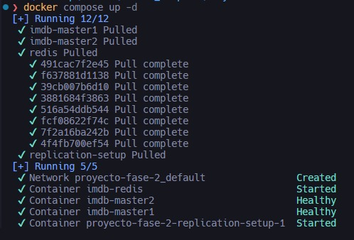
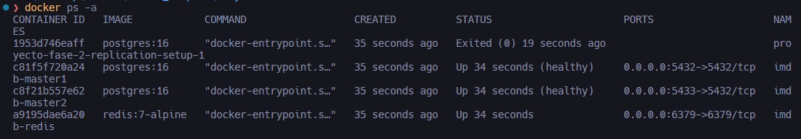

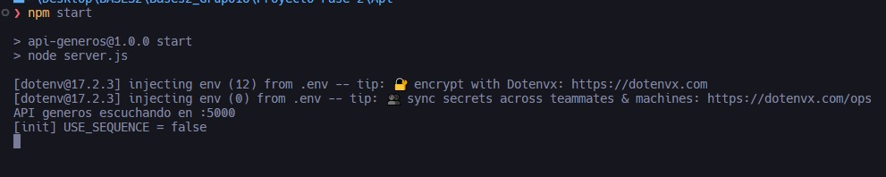
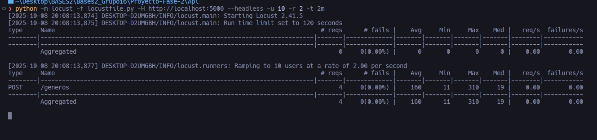
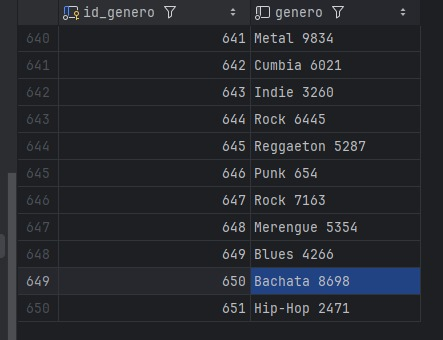
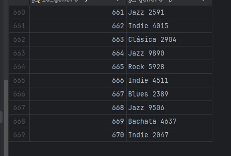

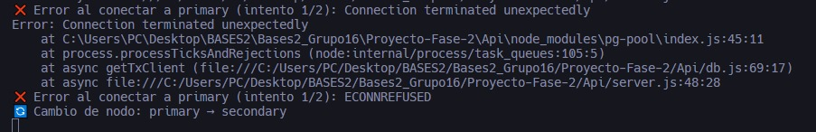


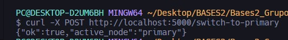
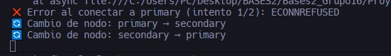
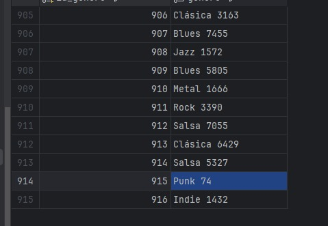
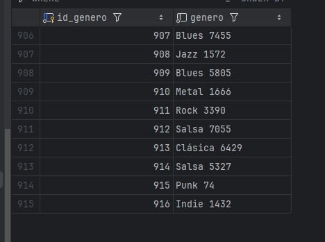


